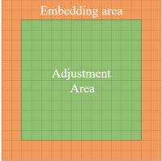
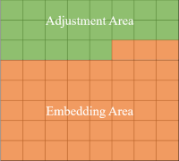
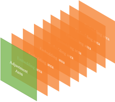

# The Second Approximate Thumbnail-preserving Image Encryption
## Direction
- The scheme is to balance the image privacy and usability by encrypting the image while preserving the thumbnail.
## Application 
- Uploading images into cloud platforms after encryption by this scheme for privacy protection.
## Environment
- Matlab
- Python
## Principle
- Based on the block and dividing the block into two areas: the adjustment area and the embedding area.
- The function of the adjustment area: preserving the sum of pixel values in one block by adjusting high bits of pixels.
- The function of the embedding area: embedding the information (hight bits of pixels in the adjustment area) in order to recovery the original image when decrypting.
## Details of the scheme
1. Room-reserving

   1. distribution of the adjustment and embedding area

      - the first distribution of the block

        

      - the second distribution of the image

        

      - the third distribution of the image

        

   2. method of the data hiding

      - method 0

        - paper

          High Capacity Reversible Data Hiding in Image Based on Adaptive MSB Prediction

        - key idea

          - based on the 2x2 bolck
          - using MED prediction
          - in each block, find the max shared high bits of four pixels and reverse the extra room for embedding, remaining the left up pixel origin for recovery process

        - framework

          

        - application

          divide the image into two areas: the embedding area and the adjustment area; the adjustment area is to adjust high rho bits of each pixel in the area so the original high rho bits value of pixels in the adjustment area are embedded into the embedding area for recovery process

          - distribution 0
          - distribution 1

        - experiment result

          - example: "lena" 1024x1024

          - distribution 1

            - parametric: blocksize, MSB, edge=NUM, type=0, method=0

              

            - visual result

          - distribution 2

            - parametric: blocksize, MSB, NUM, edge=0, type=1, method=0

              

            - visual result

        

      - method 1

        - paper

          Reversible Data Hiding in Encrypted Images Based on Pixel Prediction and Bit-plane Compression

        - key idea

          - based on bit-plane operation
          - for each bit-plane, blocking into 2x2 block and rearrange the bits, then compress them 
          - using MED to predict pixels

        - framework

          

        - application

          store all information for recovery in low bit-planes and keep high bit-planes free to adjust

        - experiment result

          - example: "lena" 1024x1024

          - parametric: blocksize, NUM, MSB, type=3|1, method=1

          - length of stored information / total room in each channel

            - R:  3448560/ 8388608
            - G:  3861643/ 8388608 
            - B:  4072728/ 8388608

          - max number of bits that can be freed: 4.12

          - visual result: the result is similar to method 3

        

      - method 2

        - paper

          An Improved Reversible Data Hiding in Encrypted Images Using Parametric Binary Tree Labeling 

        - key idea

          - Exploiting the spatial correlation of the whole image  but not inside one block

          - using parametric binary label tree to label encrypted pixels
          - if the result of prediction value - original value in valid range, it can be labeled successfully belonging to group G1, else it belong to G2 
          - using MED to prediction

        - framework

          

        - application

          divide the image into two areas: the embedding area and the adjustment area; the adjustment area is to adjust high rho bits of each pixel in the area so the original high rho bits value of pixels in the adjustment area are embedded into the embedding area for recovery process
          
          - distribution 1
          
            0: the area that keeps unchanging
          
            1: the embedding area with special prediction method 
          
            2: the embedding area with normal MED prediction method
          
            3: the adjustment area
          
            
          
          - distribution 2
          
            
          
          - tip
          
            in recovery process, we should pay attention on the order of traverse, ensuring that when recovering pixel of location (x,y), the pixels on which predictions depend have been restored. 
          
            In order to ensure the consistency of embedding and extraction processes, the traversal order of embedding must be the same as that of extraction.
          
        - experiment result

          - example: "lena" 1024x1024
          
          - distribution 1
          
            - parametric: blocksize, MSB, edge=NUM, type=0, method=2
          
              
            
            - visual result
            
              
            
              
            
              
            
          - distribution 2
          
            - parametric: blocksize, MSB, NUM, edge=0, type=1, method=2
          
              
            
            - visual result
            
              
            
              
            
              
            
              

      

      - method 3

        - paper
        
          A Recursive Reversible Data Hiding in Encrypted Images Method With a Very High Payload
        
        - the type of the distribution is the third distribution
        
        - key idea
        
          - predict and compress the bit-plane from MSB to LSB (if the compressed bit-plane is longer than the original one, this bit-plane and the  lower bit-planes are to keep original for recovery) while keeping the LSB uncompressed.
          - using MED to prediction
        
        - framework
        
          
        
        - application
        
          store all information for recovery in low bit-planes and keep high bit-planes free to adjust
        
        - experiment result
        
          - example: "lena" 1024x1024
        
          - parametric: blocksize, NUM, MSB, type=3|1, method=3
        
          - length of stored information / total room in each channel
          
            - R:  4698300 / 8388608
            - G:  5363088 / 8388608 
            - B:  5677439 / 8388608
        
          - max number of bits that can be freed: 2.58
        
          - visual result
        
            
          
            
            
            
            
            

2. Encryption

   - here we use the stream encipher

3. Adjustment 
   - goal: to keep the sum of pixels in the encrypted block as approximate as the original one  

4. Permutation

   - goal: to rearrange the pixels in the same block in order to make the result of the adjustment area randomly locate in the same block for achieving the PRP security
   - here we also use a permutation key for perfectly restoration
