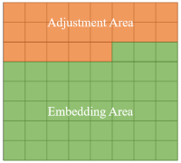

# The Second Approximate Thumbnail-preserving Image Encryption
## Direction
- The scheme is to balance the image privacy and usability by encrypting the image while preserving the thumbnail.
## Application 
- Uploading images into cloud platforms after encryption by this scheme.
## Environment
- Matlab
- Python
## Principle
- Based on the block and dividing the block into two areas: the adjustment area and the embedding area.
- The function of the adjustment area: preserving the sum of pixel values in one block by adjusting high bits of pixels.
- The function of the embedding area: embedding the information (hight bits of pixels in the adjustment area) in order to recovery the original image when decrypting.
## Details of the scheme
1. the distribution of the block
   
2. encryption
- Here we use the stream encipher

